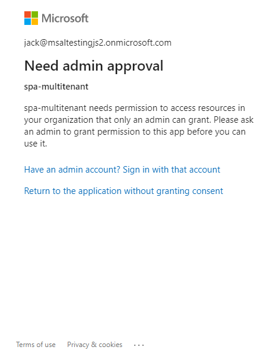

# A Multi-tenant (SaaS) JavaScript Single-Page Application (SPA) using MSAL.js to sign-in users and calling MS Graph API

A multi-tenant vanilla JavaScript single-page application (SPA) which demonstrates how to use [MSAL.js](https://github.com/AzureAD/microsoft-authentication-library-for-js) to sign-in, consent, provision, and acquire [Access tokens](https://docs.microsoft.com/azure/active-directory/develop/access-tokens) for a protected resource like [Microsoft Graph API](https://developer.microsoft.com/graph).

In order to grasp the important aspects of **multi-tenancy** in this sample, please read up the [discussion](##discussion) section below.

## Contents

| File/folder       | Description                                |
|-------------------|--------------------------------------------|
| `App`             | Contains sample source files.              |
| `auth.js`         | Main authentication logic resides here.    |
| `authConfig.js`   | Contains configuration parameters for the sample. |
| `graph.js`        | Provides a helper function for calling MS Graph API. |
| `graphConfig.js`  | Configures API endpoints for MS Graph.       |
| `ui.js`           | Contains UI logic.                         |
| `index.html`      |  Contains the UI of the sample.            |
| `CHANGELOG.md`    | List of changes to the sample.             |
| `CODE_OF_CONDUCT.md` | Code of Conduct information.            |
| `LICENSE`         | The license for the sample.                |
| `package.json`    | Package manifest for npm.                  |
| `README.md`       | This README file.                          |
| `SECURITY.md`     | Security disclosures.                      |
| `index.js`        | Implements a simple Node server to serve index.html. |

## Prerequisites

- [Node](https://nodejs.org/en/) must be installed to run this sample.
- You would need *at least* **two** Azure Active Directory (Azure AD) tenants to successfully run this sample. For more information on how to get an Azure AD tenant, see [How to get an Azure AD tenant](https://azure.microsoft.com/documentation/articles/active-directory-howto-tenant/).
- On each tenant, *at least* **one** admin account and **one** non-admin/user account should be present for testing purposes.
- A modern browser. This sample uses **ES6** conventions and will not run on **Internet Explorer**.
- We recommend [VS Code](https://code.visualstudio.com/download) for running and debugging this cross-platform application.

## Setup

Using a command line interface such as VS Code integrated terminal, install the project dependencies via **npm**.

```console
  cd chapter1
  npm install
```

## Registration

To register this project, you can:

- either follow the steps below for manual registration,
- or use PowerShell scripts that:
  - **automatically** creates the Azure AD applications and related objects (passwords, permissions, dependencies) for you.
  - modify the configuration files.

<details>
  <summary>Expand this section if you want to use this automation:</summary>

1. On Windows, run PowerShell and navigate to the root of the cloned directory
2. In PowerShell run:

   ```PowerShell
   Set-ExecutionPolicy -ExecutionPolicy RemoteSigned -Scope Process -Force
   ```

3. Run the script to create your Azure AD application and configure the code of the sample application accordingly.
4. In PowerShell run:

   ```PowerShell
   cd .\AppCreationScripts\
   .\Configure.ps1
   ```

   > Other ways of running the scripts are described in [App Creation Scripts](./AppCreationScripts/AppCreationScripts.md)
   > The scripts also provide a guide to automated application registration, configuration and removal which can help in your CI/CD scenarios.

</details>

### Register the application

1. Navigate to the Microsoft identity platform for developers [App registrations](https://go.microsoft.com/fwlink/?linkid=2083908) page.
1. Select **New registration**.
1. In the **Register an application page** that appears, enter your application's registration information:
   - In the **Name** section, enter a meaningful application name that will be displayed to users of the app, for example `multitenant-spa`.
   - Under **Supported account types**, select **Accounts in any organizational directory and personal Microsoft accounts**.
   - In the **Redirect URI (optional)** section, select **Single-page application** in the combo-box and enter the following redirect URI: `http://localhost:3000`.
1. Select **Register** to create the application.
1. In the app's registration screen, find and note the **Application (client) ID**. You use this value in your app's configuration file(s) later in your code.
1. In the app's registration screen, select **Authentication** in the menu.
   - If you don't have a platform added, select **Add a platform** and select the **Single-page application** option.
   - In the **Implicit grant** section, check the **Access tokens** and **ID tokens** option as this sample requires
     the [Implicit grant flow](https://docs.microsoft.com/azure/active-directory/develop/v2-oauth2-implicit-grant-flow) to be enabled to
     sign-in the user, and call an API.

1. Select **Save** to save your changes.
1. In the app's registration screen, click on the **API permissions** blade in the left to open the page where we add access to the Apis that your application needs.
   - Click the **Add a permission** button and then,
   - Ensure that the **Microsoft APIs** option is selected.
   - In the list of APIs, select the API `Microsoft Graph`.
   - In the **Delegated permissions** section, select the **User.Read.All** in the list. Use the search box if necessary.
   - Click on the **Add permissions** button at the bottom.

### Configure the application

Open the project in your IDE (like Visual Studio) to configure the code.

> In the steps below, "clientId" is the same as "Application ID" or "AppId".

1. Open the `App/authConfig.js` file
1. Find the app key `clientId` and replace the existing value with the application ID (clientId) of the `multitenant-spa` application copied from the Azure portal.

## Explore the sample

1. Using a command line interface such as VS Code integrated terminal, run the sample:

```console
  npm start
```

1. Open your browser and navigate to `http://localhost:3000`.

    

1. Sign-in using the button on top-right. If you haven't provided admin-consent yet, you will not be able to sign-in with a non-admin account from another tenant.

    

1. Click on the `who's in?` button at the center to see the other users in your tenant.

    

## Discussion

Here we discuss some of the more important aspects of multi-tenant single-page applications.

### /common Endpoint

### Testing the Application

To properly test this application, you need *at least* **2** tenants, and on each tenant, *at least* **1** administrator and **1** non-administrator account.

Before each test, you should delete your **service principal** for the tenant you are about to test, in order to remove any previously given consents and start the **provisioning process** from scratch.

> #### How to Delete Service Principals
>
> Steps for deleting a service principal differs with respect to whether the principal is in the **home tenant** of the application or in another tenant. If it is in the **home tenant**, you will find the entry for the application under the **App Registrations** blade. If it is another tenant, you will find the entry under the **Enterprise Applications** blade. The screenshot below shows how to access the service principal from a **home tenant**:
>
> 
>
> The rest of the process is the same for both cases. In the next screen, click on **Properties** and then the **Delete** button on the upper side.
>
> 
>
> You have now deleted the service principal for that tenant. Next time, once a user successfully authenticates to your application, a new service principal will be created (i.e. *provisioning*) in the tenant from which *that* user belongs.

### Ways of providing admin consent

A service principal of your multi-tenant app is created via one of the following ways.

1. When the first user signs-in your app for the first time in a tenant
2. Manually or programmatically created by a tenant admin using the [`/adminconsent` endpoint](https://docs.microsoft.com/azure/active-directory/develop/v2-admin-consent) or [using the PowerShell command](https://docs.microsoft.com/powershell/azure/create-azure-service-principal-azureps).

- **Consent on sign-in:**

This method requires the most minimal setup. The only thing needed is a sign-in by an admin account and clicking on the "consent on behalf of your organization" in the AAD sign-in screen below:


- **Consent by using the `/adminconsent` endpoint**

This method provides a programmatic control over the consent process. To be able to **consent as an admin** with this method, there are two steps your application needs to carry out:

1. Determine the `tenantId` of the signed-in user.
2. Redirect the user to the correct `/adminconsent` endpoint (which is why you need the `tenantId`).

In your app, to send a tenant admin to the `/adminconsent` endpoint you would construct a URL as explained below:

```HTML
    // Line breaks are for legibility only.
    GET https://login.microsoftonline.com/{tenant}/v2.0/adminconsent?
    client_id=6731de76-14a6-49ae-97bc-6eba6914391e
    &state=12345
    &redirect_uri=http://localhost/myapp/permissions
    &scope=
    https://graph.microsoft.com/calendars.read
    https://graph.microsoft.com/mail.send
```

This is demonstrated in the code snippet below:

```JavaScript
   myMSALObj.loginPopup(loginRequest)
      .then(loginResponse => {
         console.log("id_token acquired at: " + new Date().toString());

         const state = Math.floor(Math.random() * 90000) + 10000; // state parameter for anti token forgery

         // admin consent endpoint. visit X for more info
         const adminConsetUri = "https://login.microsoftonline.com/" +
         `${loginResponse.idTokenClaims.tid}` + "/v2.0/adminconsent?client_id=" +
         `${msalConfig.auth.clientId}` + "&state=" + `${state}` + "&redirect_uri=" + `${msalConfig.auth.redirectUri}` +
         "&scope=https://graph.microsoft.com/.default";

         // redirecting...
         window.location.replace(adminConsetUri);
      }
```

> #### The `.default` scope
>
> Did you notice the scope here is set to `https://graph.microsoft.com/.default`, as opposed to `https://graph.microsoft.com/User.Read.All` (or just `User.Read.All` for short)? This is a built-in scope for every application that refers to the static list of permissions configured on the application registration. Basically, it *bundles* all the permissions in one scope. The /.default scope can be used in any OAuth 2.0 flow, but is necessary when using the v2 admin consent endpoint to request application permissions.

When redirected to the `/adminconsent` endpoint, the tenant admin will see:


After you choose an admin account, it will lead to the following prompt:


Once it finishes, your application service principal will be provisioned in that tenant.

### Scopes and Sign-in Differences

The main scope of interest in this sample is `User.Read.All`. This is a MS Graph API scope, and it allows a user to read every user in the tenant. This scope requires a tenant admin to consent.

Remember that the first time you were not able to sign-in with a non-admin account before providing admin consent for that tenant.
To see why this was so, notice, in `App/authConfig.js`, the current request objects:

```JavaScript
    // scopes here will be used with loginPopup() method
    const loginRequest = {
      scopes: ["openid", "profile", "User.Read.All"]
    };

    // scopes here will be used with acquireTokenPopup() method
    const tokenRequest = {
      scopes: ["User.Read.All"]
    };
```

This means that the user will be prompted for consent during sign-in. However, since only an admin can consent to the scope `User.Read.All`, a non-admin account will simply not be able to login ))(unless consented prior by a tenant admin)! For best end-user experience, please have the tenant admin consent your app before a user from the tenant tries to sign-in.

> [!NOTE] Did the sample not work for you as expected? Did you encounter issues trying this sample? Then please reach out to us using the [GitHub Issues](../issues) page.

## Contributing

This project welcomes contributions and suggestions.  Most contributions require you to agree to a
Contributor License Agreement (CLA) declaring that you have the right to, and actually do, grant us
the rights to use your contribution. For details, visit https://cla.opensource.microsoft.com.

When you submit a pull request, a CLA bot will automatically determine whether you need to provide
a CLA and decorate the PR appropriately (e.g., status check, comment). Simply follow the instructions
provided by the bot. You will only need to do this once across all repos using our CLA.

## Code of Conduct

This project has adopted the [Microsoft Open Source Code of Conduct](https://opensource.microsoft.com/codeofconduct/).
For more information see the [Code of Conduct FAQ](https://opensource.microsoft.com/codeofconduct/faq/) or
contact [opencode@microsoft.com](mailto:opencode@microsoft.com) with any additional questions or comments.
