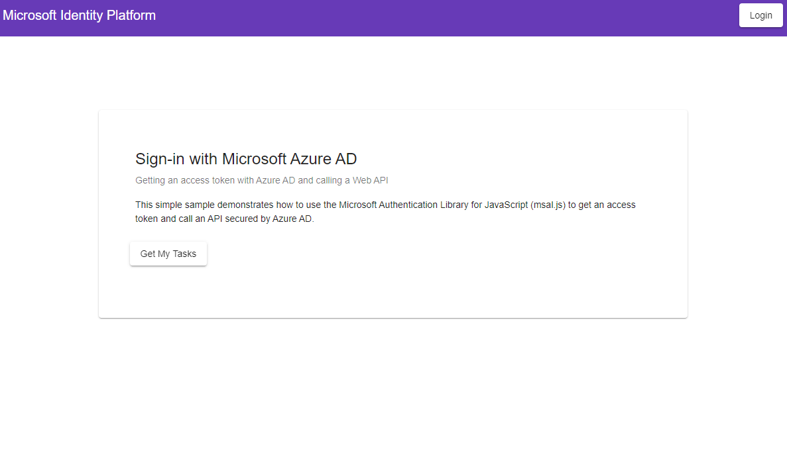
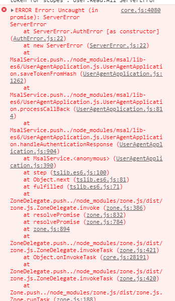
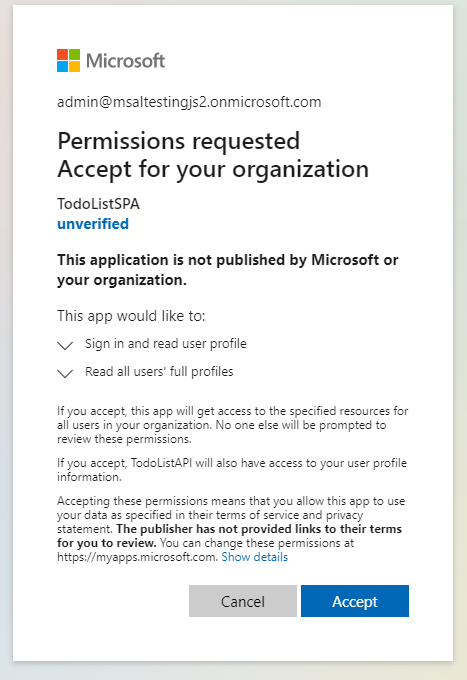
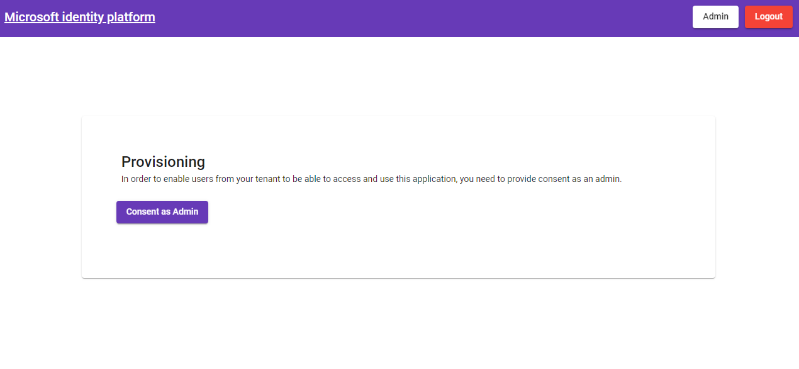
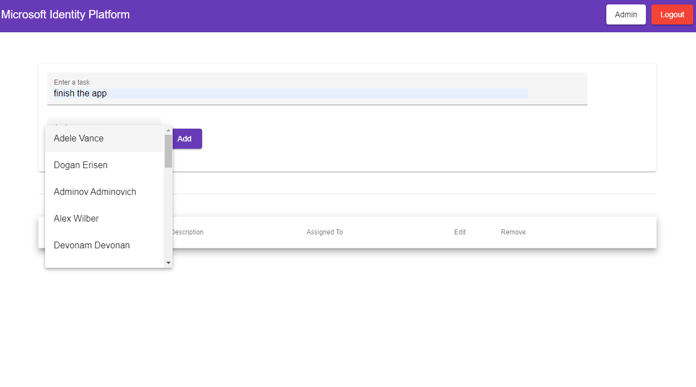

# A multi-tenant (SaaS) Angular single-page application (SPA) that authenticates users with Azure AD and calls a protected ASP.NET Core web API

 1. [Overview](#overview)
 1. [Scenario](#scenario)
 1. [Contents](#contents)
 1. [Prerequisites](#prerequisites)
 1. [Setup](#setup)
 1. [Registration](#registration)
 1. [Running the sample](#running-the-sample)
 1. [Explore the sample](#explore-the-sample)
 1. [About the code](#about-the-code)
 1. [More information](#more-information)
 1. [Community Help and Support](#community-help-and-support)
 1. [Contributing](#contributing)

This sample demonstrates how to develop a multi-tenant, cross-platform application suite comprising of an Angular SPA (*TodoListSPA*) calling an ASP.NET Core web API (*TodoListAPI*) secured with Azure Active Directory (Azure AD). Due to the topology of this application suite (*multi-tier*, *multi-tenant*), additional steps are needed for making the apps available to users in other tenants.

In order to grasp the relevant aspects of **multi-tenancy** covered in the sample, please follow [About the code](#about-the-code) section below.

## Scenario

- **TodoListSPA** uses [MSAL Angular (Preview)](https://github.com/AzureAD/microsoft-authentication-library-for-js/tree/dev/lib/msal-angular) to authenticate a user and obtains an [access token](https://docs.microsoft.com/azure/active-directory/develop/access-tokens) from Azure AD in the name of the current user.
- The access token is then used by the **TodoListAPI** to authorize the user.
- **TodoListAPI** uses [Microsoft.Identity.Web](https://github.com/AzureAD/microsoft-identity-web) to protect its endpoint and accept authorized calls.


## Contents

| File/folder       | Description                                |
|-------------------|--------------------------------------------|
| `AppCreationScripts` | Contains Powershell scripts to automate app registrations. |
| `TodoListAPI/appsettings.json` | Authentication configuration parameters. |
| `TodoListSPA/src/app/auth-config.json` | Authentication configuration parameters. |

## Prerequisites

- [Node.js](https://nodejs.org/en/download/) must be installed to run this sample.
- [Dotnet Core SDK](https://dotnet.microsoft.com/download) must be installed to run this sample.
- You would need *at least* **two** Azure Active Directory (Azure AD) tenants to successfully run this sample. For more information on how to get an Azure AD tenant, see [How to get an Azure AD tenant](https://azure.microsoft.com/documentation/articles/active-directory-howto-tenant/).
- On each tenant, *at least* **one** admin account (:warning: i.e. global admin) and **one** non-admin/user account should be present for testing purposes.
- A modern browser. This sample uses **ES6** conventions and will not run on **Internet Explorer**.
- We recommend [VS Code](https://code.visualstudio.com/download) for running and debugging this cross-platform application.

## Setup

Using a command line interface such as VS Code integrated terminal, follow the steps below:

### Step 1. Install .NET Core API dependencies

```console
   cd TodoListAPI
   dotnet restore
```

### Step 2. Trust development certificates

```console
   dotnet dev-certs https --clean
   dotnet dev-certs https --trust
```

Learn more about [HTTPS in .NET Core](https://docs.microsoft.com/aspnet/core/security/enforcing-ssl).

### Step 3. Install Angular SPA dependencies

```console
   cd ../
   cd TodoListSPA
   npm install
```

## Registration

There are two projects in this sample. Each needs to be separately registered in your Azure AD tenant. To register these projects, you can:

- either follow the steps below for manual registration,
- or use PowerShell scripts that:
  - **automatically** creates the Azure AD applications and related objects (passwords, permissions, dependencies) for you.
  - modify the configuration files.

<details>
  <summary>Expand this section if you want to use this automation:</summary>

1. On Windows, run PowerShell and navigate to the root of the cloned directory
1. In PowerShell run:

   ```PowerShell
   Set-ExecutionPolicy -ExecutionPolicy RemoteSigned -Scope Process -Force
   ```

1. Run the script to create your Azure AD application and configure the code of the sample application accordingly.
1. In PowerShell run:

   ```PowerShell
   cd .\AppCreationScripts\
   .\Configure.ps1
   ```

   > Other ways of running the scripts are described in [App Creation Scripts](./AppCreationScripts/AppCreationScripts.md)
   > The scripts also provide a guide to automated application registration, configuration and removal which can help in your CI/CD scenarios.

</details>

### Register the service app (TodoListAPI)

1. Navigate to the Microsoft identity platform for developers [App registrations](https://go.microsoft.com/fwlink/?linkid=2083908) page.
1. Select **New registration**.
1. In the **Register an application page** that appears, enter your application's registration information:
   - In the **Name** section, enter a meaningful application name that will be displayed to users of the app, for example `TodoListAPI`.
   - Under **Supported account types**, select **Accounts in any organizational directory**.
1. Select **Register** to create the application.
1. In the app's registration screen, find and note the **Application (client) ID**. You use this value in your app's configuration file(s) later in your code.
1. Select **Save** to save your changes.
1. In the app's registration screen, select the **API permissions** blade in the left to open the page where we add access to the APIs that your application needs.
   - Click the **Add a permission** button and then,
   - Ensure that the **Microsoft APIs** tab is selected.
   - In the *Commonly used Microsoft APIs* section, select **Microsoft Graph**
   - In the **Delegated permissions** section, select the **User.Read** in the list. Use the search box if necessary.
   - Select the **Add permissions** button at the bottom.
1. In the app's registration screen, select the **Expose an API** blade to the left to open the page where you can declare the parameters to expose this app as an API for which client applications can obtain [access tokens](https://docs.microsoft.com/azure/active-directory/develop/access-tokens) for.
The first thing that we need to do is to declare the unique [resource](https://docs.microsoft.com/azure/active-directory/develop/v2-oauth2-auth-code-flow) URI that the clients will be using to obtain access tokens for this API. To declare an resource URI, follow the following steps:
   - Click `Set` next to the **Application ID URI** to generate a URI that is unique for this app.
   - For this sample, accept the proposed Application ID URI (api://{clientId}) by selecting **Save**.
1. All APIs have to publish a minimum of one [scope](https://docs.microsoft.com/azure/active-directory/develop/v2-oauth2-auth-code-flow#request-an-authorization-code) for the client's to obtain an access token successfully. To publish a scope, follow the following steps:
   - Select **Add a scope** button open the **Add a scope** screen and Enter the values as indicated below:
        - For **Scope name**, use `access_as_user`.
        - Select **Admins and users** options for **Who can consent?**
        - For **Admin consent display name** type `Access TodoListAPI`
        - For **Admin consent description** type `Allows the app to access TodoListAPI as the signed-in user.`
        - For **User consent display name** type `Access TodoListAPI`
        - For **User consent description** type `Allow the application to access TodoListAPI on your behalf.`
        - Keep **State** as **Enabled**
        - Select the **Add scope** button on the bottom to save this scope.

#### Configure the  service app (TodoListAPI) to use your app registration

Open the project in your IDE (like Visual Studio) to configure the code.
>In the steps below, "ClientID" is the same as "Application ID" or "AppId".

1. Open the `TodoListAPI\appsettings.json` file.
1. Find the app key `Domain` and replace the existing value with your Azure AD tenant name.
1. Find the app key `ClientId` and replace the existing value with the application ID (clientId) of the **TodoListAPI** application copied from the Azure portal.

### Register the client app (TodoListSPA)

1. Navigate to the Microsoft identity platform for developers [App registrations](https://go.microsoft.com/fwlink/?linkid=2083908) page.
1. Select **New registration**.
1. In the **Register an application page** that appears, enter your application's registration information:
   - In the **Name** section, enter a meaningful application name that will be displayed to users of the app, for example `TodoListSPA`.
   - Under **Supported account types**, select **Accounts in any organizational directory**.
   - In the **Redirect URI** section, select **Single-page application** in the combo-box and enter the following redirect URI: `http://localhost:4200`.
1. Select **Register** to create the application.
1. In the app's registration screen, find and note the **Application (client) ID**. You use this value in your app's configuration file(s) later in your code.
1. In the app's registration screen, select the **API permissions** blade in the left to open the page where we add access to the APIs that your application needs.
   - Click the **Add a permission** button and then,
     - Ensure that the **My APIs** tab is selected.
     - In the list of APIs, select the API `TodoListAPI`.
     - In the **Delegated permissions** section, select the **access_as_user** in the list. Use the search box if necessary.
     - Select the **Add permissions** button at the bottom.
   - Click the **Add a permission** button and then:
     - Ensure that the **Microsoft APIs** tab is selected.
     - In the *Commonly used Microsoft APIs* section, select **Microsoft Graph**
     - In the **Delegated permissions** section, select the **User.Read**, **User.Read.All** in the list. Use the search box if necessary.
     - Select the **Add permissions** button at the bottom.

> :warning: The next step requires you to go back to your TodoListAPI registration.

1. Now you need to leave the registration for **TodoListSPA** and *go back to your app registration* for **TodoListAPI**.
   - From the app's Overview page, select the Manifest section.
   - Find the entry for `KnownClientApplications`, and add the Application (client) ID of the `TodoListSPA` application copied from the Azure portal. i.e. `KnownClientApplications: [ "your_client_id_for_TodoListSPA" ]`

#### Configure the client app (TodoListSPA) to use your app registration

Open the project in your IDE (like Visual Studio) to configure the code.

> In the steps below, "ClientID" is the same as "Application ID" or "AppId".

1. Open the `TodoListSPA\src\app\auth-config.json` file
1. Find the app key `clientId` and replace the existing value with the application ID (clientId) of the **TodoListSPA** application copied from the Azure portal.
1. Find the app key `webApi.resourceUri` and replace the existing value with the endpoint of the **TodoListAPI** (by default `https://localhost:44351/api/todolist`).
1. Find the app key `webApi.resourceScopes` and replace the existing value with *scope* you created earlier e.g. `api://{clientId-of-TodoListAPI}/.default`.

## Run the sample

Using a command line interface such as **VS Code** integrated terminal, locate the application directory. Then:  

```console
   cd ../
   cd TodoListSPA
   npm start
```

In a separate console window, execute the following commands

```console
   cd TodoListAPI
   dotnet run
```

## Explore the sample

1. Open your browser and navigate to `http://localhost:4200`.

1. Sign-in using the button on top-right:



Regular users won't be able to sign-in, until an **admin-user** provides **admin-consent** to application permissions.



You can either consent as admin during initial sign-in, or if you miss this step, via the **Admin** page





1. Once **admin-consent** is provided, users can select the **Get my tasks** button to access the todo list. When you create a new task, you will also have an option to assign it to any other user from your tenant:



> :information_source: Consider taking a moment to [share your experience with us](https://forms.office.com/Pages/ResponsePage.aspx?id=v4j5cvGGr0GRqy180BHbR73pcsbpbxNJuZCMKN0lURpUOE9NQjZCMEs4NEtZQ0JFMzBDSTU2WUtBMSQlQCN0PWcu)

## About the code

We have just finished testing this provision topology in our single-tenant. Now we will discuss what you need to do further to provision the apps into another tenant and let the users from other tenants sign-in.

### Consenting to applications with distributed topology

Consider the application suite in this chapter: **TodoListAPI** and **TodoListSPA**. From one perspective, they are two different applications (two different projects), each represented with their own **app registration** on Azure AD, but from another perspective, they really constitute one application together i.e. a todo list application. In practice, an application can have a many such components: one component for the front-end, another for a REST API, another for a database and etc. While these components should have their own separate representation on Azure AD, they should also somehow know one another.

From the perspective of **multi-tenancy**, the main challenge with such topologies is with providing admin-consent. This is due to the fact that some of their components, such as a web API or a background micro-service, do not have a front-end, and as such, has no user-interaction capability. The solution for this is to allow the user (in this case, an admin-user) to consent to web API at the same time they consent to the front-end application i.e. give a **combined consent**. In **Chapter 1**, we have seen that the `/.default` scope can be used to this effect, allowing you to consent to many different scopes at one step. However, unlike **Chapter 1**, our application suite here also has a back-end/web API component. But how could the web API know that the consent comes from a recognized front-end application, as opposed to some foreign application? The answer is to use the **KnownClientApplications** feature.

> #### KnownClientApplications
>
> **KnownClientApplications** is an attribute in **application manifest**. It is used for bundling consent if you have a solution that contains two (or more) parts: a client app and a custom web API. If you enter the `appID` (clientID) of the client app into this array, the user will only have to consent only once to the client app. Azure AD will know that consenting to the client means implicitly consenting to the web API. It will automatically provision service principals for both the client and web API at the same time. Both the client and the web API app must be registered in the same tenant.

If you remember the last step of the registration for the client app **TodoListSPA**, you were instructed to find the `KnownClientApplications` in application manifest, and add the **application ID** (client ID) of the `TodoListSPA` application `KnownClient witApplications: ["your-client-id-for-TodoListSPA"]`. Once you do that, your web API will be able to correctly identify your front-end and the combined consent will be successfully carried out.

### Provisioning your multi-tenant apps in another Azure AD tenant

Often the user-based consent will be disabled in an Azure AD tenant or your application will be requesting permissions that requires a tenant-admin consent. In these scenarios, your application will need to utilize the `/adminconsent` endpoint to provision both the **TodoListSPA** and the **TodoListAPI** before the users from that tenant are able to sign-in to your app.

When provisioning, you have to take care of the dependency in the topology where the **TodoListSPA** is dependent on **TodoListAPI**. So in such a case, you would provision the **TodoListAPI** before the **TodoListSPA**.

### Admin consent at different stages of application flow

This application requires an **admin-user** to consent to scope `api://{clientId-of-TodoListAPI}/.default` in order to provision the **TodoListAPI** web API to a tenant. This means **Azure AD** will check if **admin-consent** is provided to the aforementioned scope during the initial sign-in. As such, only a user with admin privileges will be able to sign-in for the **first time**. After that, any user from that admin's tenant can sign-in and use the application. This allows you to control whether an ordinary users can provision a **multi-tenant** app into their tenants.

If you would like to change this behavior i.e. allow regular users to sign-in to the app before *admin-consent* you can modify the [app.module.ts](./TodoListSPA/src/app/app.module.ts) as below. Bear in mind, until *admin-consent* is provided, users won't be able to access the **TodoListAPI**, resulting in bad user experience.

```typescript
export function MSALGuardConfigFactory(): MsalGuardConfiguration {
  return { 
    interactionType: InteractionType.Redirect,
   //  authRequest: {
   //    scopes: [...auth.resources.todoListApi.resourceScopes],
   //  },
  };
}
```

### Custom token validation allowing only registered tenants

By marking your application as multi-tenant, your application will be able to sign-in users from any Azure AD tenant out there. Now you would want to restrict the tenants you want to work with. For this, we will now extend token validation to only those Azure AD tenants registered in the application database. Below, the event handler `OnTokenValidated` was configured to grab the `tenantId` from the token claims and check if it has an entry on the records. If it doesn't, an exception is thrown, canceling the authentication. (See: [Startup.cs](./TodoListAPI/Startup.cs))

```csharp
   services.Configure<JwtBearerOptions>(JwtBearerDefaults.AuthenticationScheme, options =>
   {
      options.Events.OnTokenValidated = async context =>
      {
         string[] allowedTenants = { /* a list of IDs... */ };

         string tenantId = ((JwtSecurityToken)context.SecurityToken).Claims.FirstOrDefault(x => x.Type == "tid" || x.Type == "http://schemas.microsoft.com/identity/claims/tenantid")?.Value;

         if (!allowedTenants.Contains(tenantId))
         {
               throw new UnauthorizedAccessException("This tenant is not authorized");
         }
      };
   });
```

## Next step

Let's now proceed to [Chapter 3](../Chapter3/README.md) of this tutorial where we demonstrate how to deploy this project on **Azure Storage** (for TodoListSPA) and **Azure App Service** (for TodoListAPI).

> : information_source: Did the sample not work for you as expected? Did you encounter issues trying this sample? Then please reach out to us using the [GitHub Issues](../../../issues) page.

## Debugging the sample

To debug the .NET Core Web API that comes with this sample, install the [C# extension](https://marketplace.visualstudio.com/items?itemName=ms-dotnettools.csharp) for Visual Studio Code.

Learn more about using [.NET Core with Visual Studio Code](https://docs.microsoft.com/dotnet/core/tutorials/with-visual-studio-code).

## Learn more

To learn more about single and multi-tenant apps, see:

- [Multi-tenant SaaS database tenancy patterns](https://docs.microsoft.com/azure/sql-database/saas-tenancy-app-design-patterns)
- [How to configure a new multi-tenant application](https://docs.microsoft.com/azure/active-directory/develop/setup-multi-tenant-app)
- [How to: Sign in any Azure Active Directory user using the multi-tenant application pattern](https://docs.microsoft.com/azure/active-directory/develop/howto-convert-app-to-be-multi-tenant)
- [Add a multitenant application to the Azure AD application gallery](https://docs.microsoft.com/azure/active-directory/develop/registration-config-multi-tenant-application-add-to-gallery-how-to)

To learn more about token validation, see:

- [Validating an ID token](https://docs.microsoft.com/azure/active-directory/develop/id-tokens#validating-an-id_token)
- [Validating an access token](https://docs.microsoft.com/azure/active-directory/develop/access-tokens#validating-tokens)

## Community Help and Support

Use [Stack Overflow](http://stackoverflow.com/questions/tagged/msal) to get support from the community.
Ask your questions on Stack Overflow first and browse existing issues to see if someone has asked your question before.
Make sure that your questions or comments are tagged with [`azure-active-directory` `azure-ad-b2c` `ms-identity` `adal` `msal`].

If you find a bug in the sample, raise the issue on [GitHub Issues](../../../issues).

To provide feedback on or suggest features for Azure Active Directory, visit [User Voice page](https://feedback.azure.com/forums/169401-azure-active-directory).

## Contributing

If you'd like to contribute to this sample, see [CONTRIBUTING.MD](/CONTRIBUTING.md).

This project has adopted the [Microsoft Open Source Code of Conduct](https://opensource.microsoft.com/codeofconduct/). For more information, see the [Code of Conduct FAQ](https://opensource.microsoft.com/codeofconduct/faq/) or contact [opencode@microsoft.com](mailto:opencode@microsoft.com) with any additional questions or comments.
