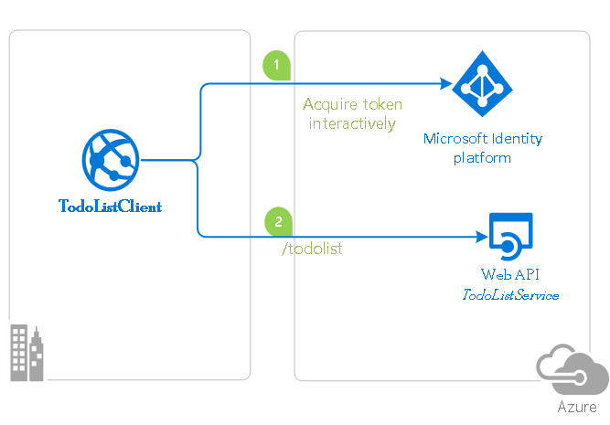
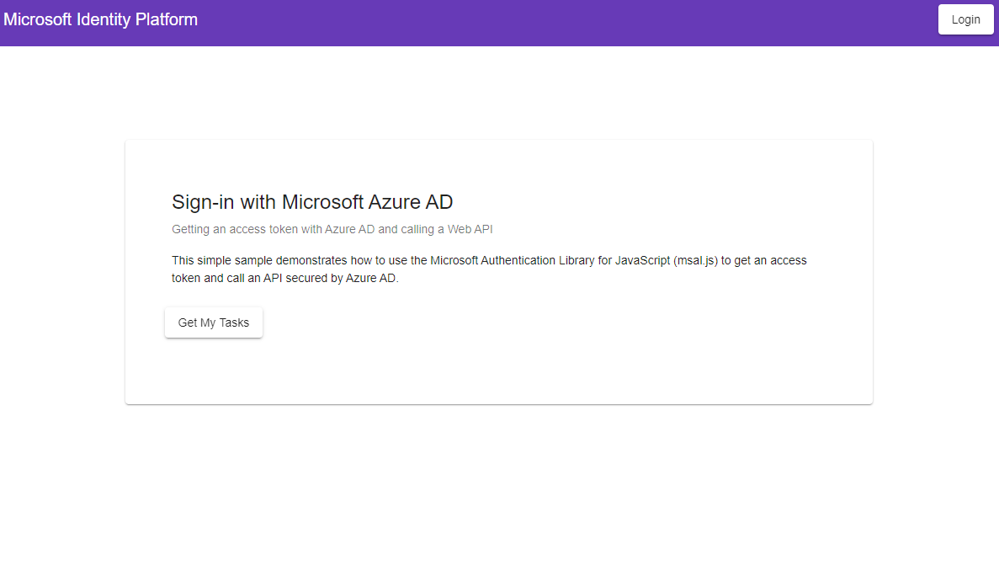
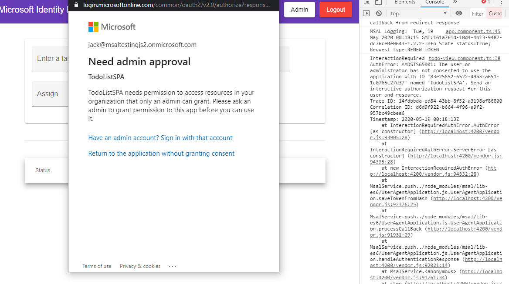
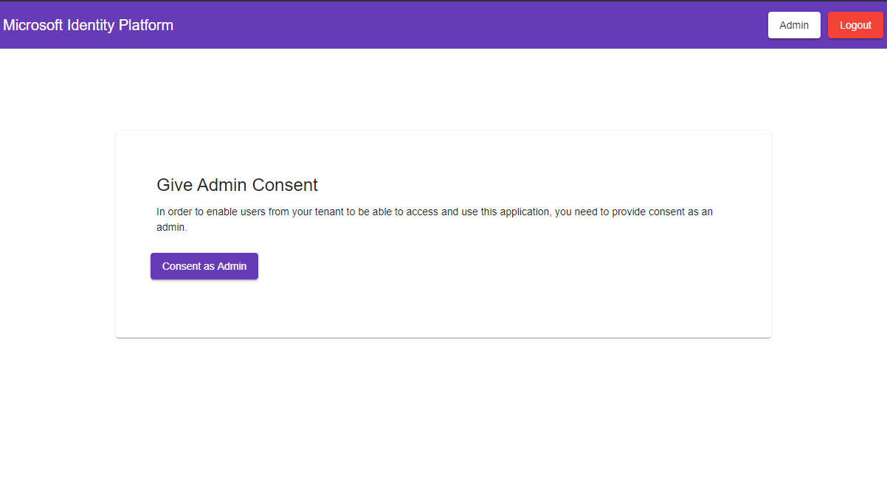

# A Multi-tenant Angular single-page application that authenticates users with Azure AD and calls a protected ASP.NET Core Web API

This sample demonstrates a multi-tenant, cross-platform application suite involving an Angular SPA (*TodoListSPA*) calling an ASP.NET Core Web API (*TodoListAPI*) secured with Azure Active Directory. Due to the distributed topology of this application suite, additional steps are needed for making it multi-tenant.

In order to grasp the important aspects of **multitenancy** in this sample, please follow the [discussion](##discussion) section below.

## Scenario

- TodoListSPA uses [MSAL.js](https://github.com/AzureAD/microsoft-authentication-library-for-js) and [MSAL-Angular](https://github.com/AzureAD/microsoft-authentication-library-for-js/tree/dev/lib/msal-angular) to authenticate a user.
- The app then obtains an [access token](https://docs.microsoft.com/azure/active-directory/develop/access-tokens) from Azure Active Directory (Azure AD) on behalf of the authenticated user.
- The access token is then used to authorize the call to the TodoListAPI.
- TodoListAPI uses [MSAL.NET](https://github.com/AzureAD/microsoft-authentication-library-for-dotnet) and [Microsoft.Identity.Web](https://github.com/AzureAD/microsoft-identity-web) to protect its endpoint and accept authorized calls.



> [!NOTE]
> This sample uses Angular 9 with .NET Core 3.1 and is configured to support sign-ins with **personal Microsoft accounts**.

## Contents

| File/folder       | Description                                |
|-------------------|--------------------------------------------|
| `TodoListAPI` | Source code of the TodoList API.               |
| `TodoListSPA` | Source code of the TodoList client SPA.        |
| `CHANGELOG.md`    | List of changes to the sample.             |
| `CONTRIBUTING.md` | Guidelines for contributing to the sample. |
| `README.md`       | This README file.                          |
| `LICENSE`         | The license for the sample.                |

## Prerequisites

- [Node.js](https://nodejs.org/en/download/) must be installed to run this sample.
- [Angular-cli](https://cli.angular.io/) must be installed to run this sample.
- [Dotnet Core SDK](https://dotnet.microsoft.com/download) must be installed to run this sample.
- *At least* **two** Azure Active Directory (Azure AD) tenants. For more information on how to get an Azure AD tenant, see [How to get an Azure AD tenant](https://azure.microsoft.com/documentation/articles/active-directory-howto-tenant/).
- On each tenant, *at least* **one** admin account and **one** non-admin/user account for testing purposes.
- A modern Browser. This sample uses **ES6** conventions and will not run on **Internet Explorer**.
- We recommend [VS Code](https://code.visualstudio.com/download) for running and debugging this cross-platform application.

## Setup

Using a command line interface such as VS Code integrated terminal, follow the steps below:

### Step 1. Install .NET Core API dependencies

```console
   cd TodoListAPI
   dotnet restore
```

### Step 2. Trust development certificates

```console
   dotnet dev-certs https --clean
   dotnet dev-certs https --trust
```

Learn more about [HTTPS in .NET Core](https://docs.microsoft.com/aspnet/core/security/enforcing-ssl).

### Step 3. Install Angular SPA dependencies

```console
   cd ../
   cd TodoListSPA
   npm install
```

## Registration

There are two projects in this sample. Each needs to be registered separately in your Azure AD tenant.

### Register the service app (TodoListAPI)

1. Navigate to the Microsoft identity platform for developers [App registrations](https://go.microsoft.com/fwlink/?linkid=2083908) page.
1. Select **New registration**.
1. In the **Register an application page** that appears, enter your application's registration information:
   - In the **Name** section, enter a meaningful application name that will be displayed to users of the app, for example `TodoListAPI`.
   - Under **Supported account types**, select **Accounts in any organizational directory and personal Microsoft accounts**.
1. Select **Register** to create the application.
1. In the app's registration screen, find and note the **Application (client) ID**. You use this value in your app's configuration file(s) later in your code.
1. Select **Save** to save your changes.
1. In the app's registration screen, click on the **Expose an API** blade to the left to open the page where you can declare the parameters to expose this app as an Api for which client applications can obtain [access tokens](https://docs.microsoft.com/azure/active-directory/develop/access-tokens) for.
The first thing that we need to do is to declare the unique [resource](https://docs.microsoft.com/azure/active-directory/develop/v2-oauth2-auth-code-flow) URI that the clients will be using to obtain access tokens for this Api. To declare an resource URI, follow the following steps:
   - Click `Set` next to the **Application ID URI** to generate a URI that is unique for this app.
   - For this sample, accept the proposed Application ID URI (api://{clientId}) by selecting **Save**.
1. All Apis have to publish a minimum of one [scope](https://docs.microsoft.com/azure/active-directory/develop/v2-oauth2-auth-code-flow#request-an-authorization-code) for the client's to obtain an access token successfully. To publish a scope, follow the following steps:
   - Select **Add a scope** button open the **Add a scope** screen and Enter the values as indicated below:
        - For **Scope name**, use `access_as_user`.
        - Select **Admins and users** options for **Who can consent?**
        - For **Admin consent display name** type `Access TodoListAPI`
        - For **Admin consent description** type `Allows the app to access TodoListAPI as the signed-in user.`
        - For **User consent display name** type `Access TodoListAPI`
        - For **User consent description** type `Allow the application to access TodoListAPI on your behalf.`
        - Keep **State** as **Enabled**
        - Click on the **Add scope** button on the bottom to save this scope.

#### Configure the  service app (TodoListAPI) to use your app registration

Open the project in your IDE (like Visual Studio) to configure the code.
>In the steps below, "ClientID" is the same as "Application ID" or "AppId".

1. Open the `TodoListAPI\appsettings.json` file.
1. Find the app key `Domain` and replace the existing value with your Azure AD tenant name.
1. Find the app key `ClientId` and replace the existing value with the application ID (clientId) of the `TodoListAPI` application copied from the Azure portal.

### Register the client app (TodoListSPA)

1. Navigate to the Microsoft identity platform for developers [App registrations](https://go.microsoft.com/fwlink/?linkid=2083908) page.
1. Select **New registration**.
1. In the **Register an application page** that appears, enter your application's registration information:
   - In the **Name** section, enter a meaningful application name that will be displayed to users of the app, for example `TodoListSPA`.
   - Under **Supported account types**, select **Accounts in any organizational directory and personal Microsoft accounts**.
   - In the **Redirect URI** section, select **Single-page application** in the combo-box and enter the following redirect URI: `http://localhost:4200/`.
1. Select **Register** to create the application.
1. In the app's registration screen, find and note the **Application (client) ID**. You use this value in your app's configuration file(s) later in your code.
1. In the app's registration screen, select **Authentication** in the menu.
   - If you don't have a platform added, select **Add a platform** and select the **Single-page application** option.
   - In the **Implicit grant** section, check the **Access tokens** and **ID tokens** option as this sample requires
     the [Implicit grant flow](https://docs.microsoft.com/azure/active-directory/develop/v2-oauth2-implicit-grant-flow) to be enabled to
     sign-in the user, and call an API.

1. Select **Save** to save your changes.
1. In the app's registration screen, click on the **API permissions** blade in the left to open the page where we add access to the APIs that your application needs.
   - Click the **Add a permission** button and then,
     - Ensure that the **Microsoft APIs** tab is selected
     - In the list of APIs, select the API **Microsoft Graph**.
     - In the **Delegated permissions** section, select the **User.Read.All** in the list. Use the search box if necessary.
     - Click on the **Add permissions** button at the bottom.
   - Click the **Add a permission** button again and then,
     - Ensure that the **My APIs** tab is selected.
     - In the list of APIs, select the API `TodoListAPI`.
     - In the **Delegated permissions** section, select the **access_as_user** in the list. Use the search box if necessary.
     - Click on the **Add permissions** button at the bottom.

1. Now you need to leave the registration for `TodoListSPA` and **go back to your app registration** for `TodoListAPI`.
   - From the app's Overview page, select the Manifest section.
   - Find the entry for `KnownClientApplications`, and add the Application (client) ID of the `TodoListSPA` application copied from the Azure portal. i.e. `KnownClientApplications: [ "your-client-id-for-TodoListSPA" ]`

#### Configure the client app (TodoListSPA) to use your app registration

Open the project in your IDE (like Visual Studio) to configure the code.
>In the steps below, "ClientID" is the same as "Application ID" or "AppId".

1. Open the `TodoListSPA\src\app\app-config.json` file
1. Find the app key `clientId` and replace the existing value with the application ID (clientId) of the `TodoListSPA` application copied from the Azure portal.
1. Find the app key `redirectUri` and replace the existing value with the base address of the TodoListSPA project (by default `http://localhost:4200`).
1. Find the app key `postLogoutRedirectUri` and replace the existing value with the base address of the TodoListSPA project (by default `http://localhost:4200`).
1. Find the app key `webApi.resourceUri` and replace the existing value with the base address of the TodoListAPI project (by default `https://localhost:44351/api/todolist`).
1. Find the app key `webApi.resourceScope` and replace the existing value with *Scope* you created earlier `api://{clientId}/access_as_user`.

## Run the sample

Using a command line interface such as VS Code integrated terminal, locate the application directory. Then:  

```console
   cd ../
   cd TodoListSPA
   npm start
```

In a separate console window, execute the following commands

```console
   cd TodoListAPI
   dotnet run
```

## Debugging the sample

To debug the .NET Core Web API that comes with this sample, install the [C# extension](https://marketplace.visualstudio.com/items?itemName=ms-dotnettools.csharp) for Visual Studio Code.

Learn more about using [.NET Core with Visual Studio Code](https://docs.microsoft.com/dotnet/core/tutorials/with-visual-studio-code).

## Explore the sample

1. Open your browser and navigate to `http://localhost:4200`.

1. Sign-in using the button on top-right:



1. Click on the "Get my tasks" button to access your todo list.

> If you have not provided **admin-consent** yet, you will get the following screen:
>
> 
>
> To provide **admin-consent**, navigate to the consent page by clicking on the "Admin" button on the top-right corner.
>
>

1. When you create a new task, you will also have an option to assign it to any other user from your tenant:


## Discussion

Here we discuss some of the more peculiar aspects of multi-tenant application suites.

### Consenting to Applications with Distributed Topology

Consider the application suite in this chapter: **TodoListAPI** and **TodoListSPA**. From one perspective, they are two different applications (two different projects), each represented with their own **app registration** on Azure AD, but from another perspective, they really constitute one application together i.e. a todo list application. In practice, an application can have a many such components: one component for the front-end, another for a REST API, another for a database and etc. While these components should have their own separate representation on Azure AD, they should also somehow know one another.

From the perspective of **multi-tenancy**, the main challenge with such applications is with providing admin-consent. This is due to the fact that some of their components, such as a web API or a background microservice, do not have a front-end, and as such, has no user-interaction capability. The solution for this is to allow the user (in this case, an admin-user) to consent to web API at the same time they consent to the front-end application i.e. give a **combined consent**. In **chapter 1**, we have seen that the `/.default` scope can be used to this effect, allowing you to consent to many different scopes at one step. However, unlike **chapter 1**, our application suite here has a back-end/web API component. But how could the web API know that the consent comes from a recognized front-end application, as opposed to some foreign application? The answer is the **KnownClientApplications** attribute.

> #### KnownClientApplications
>
> **KnownClientApplications** is an attribute in **application manifest**. It is used for bundling consent if you have a solution that contains two parts: a client app and a custom web API app. If you enter the `appID` of the client app into this value, the user will only have to consent once to the client app. Azure AD will know that consenting to the client means implicitly consenting to the web API. It will automatically provision service principals for both the client and web API at the same time. Both the client and the web API app must be registered in the same tenant.

If you remember the last step of the registration for the client app (TodoListSPA), you were instructed to find the `KnownClientApplications` in application manifest, and add the Application (client) ID of the `TodoListSPA` application `KnownClienent witApplications: [ "your-client-id-for-TodoListSPA" ]`. Once you do that, your web API will be able to correctly identify your front-end and the combined consll be succesfully carried out.

> [!NOTE] Did the sample not work for you as expected? Did you encounter issues trying this sample? Then please reach out to us using the [GitHub Issues](../issues) page.

## Contributing

This project welcomes contributions and suggestions.  Most contributions require you to agree to a
Contributor License Agreement (CLA) declaring that you have the right to, and actually do, grant us
the rights to use your contribution. For details, visit https://cla.opensource.microsoft.com.

When you submit a pull request, a CLA bot will automatically determine whether you need to provide
a CLA and decorate the PR appropriately (e.g., status check, comment). Simply follow the instructions
provided by the bot. You will only need to do this once across all repos using our CLA.

## Code of Conduct

This project has adopted the [Microsoft Open Source Code of Conduct](https://opensource.microsoft.com/codeofconduct/).
For more information see the [Code of Conduct FAQ](https://opensource.microsoft.com/codeofconduct/faq/) or
contact [opencode@microsoft.com](mailto:opencode@microsoft.com) with any additional questions or comments.
