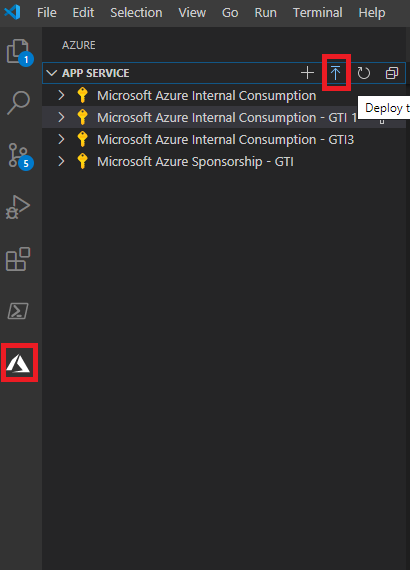
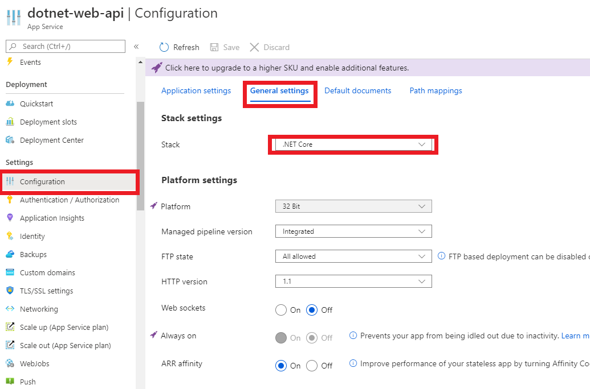
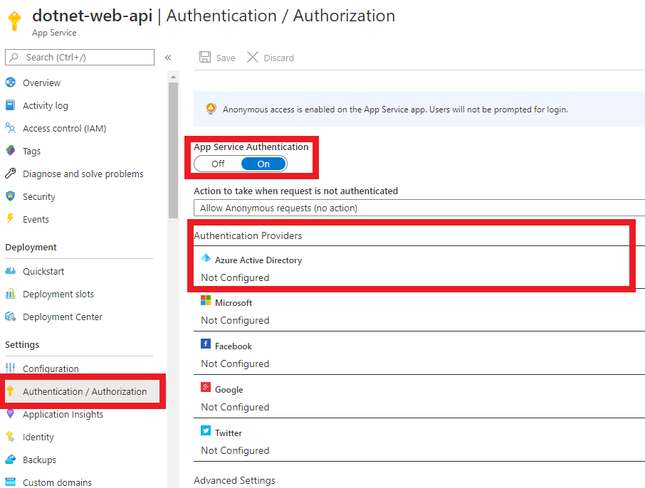
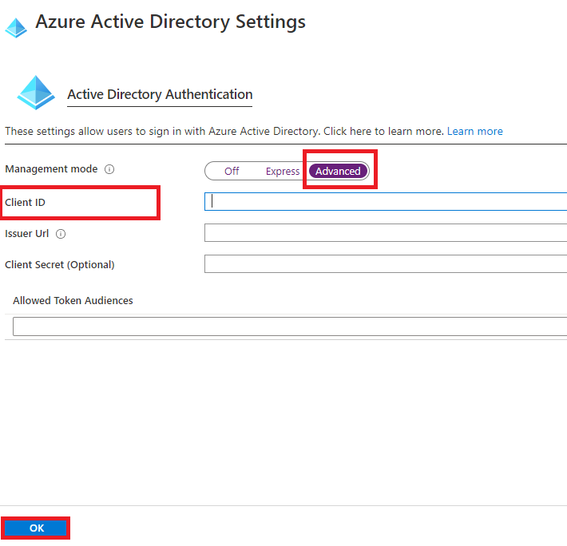
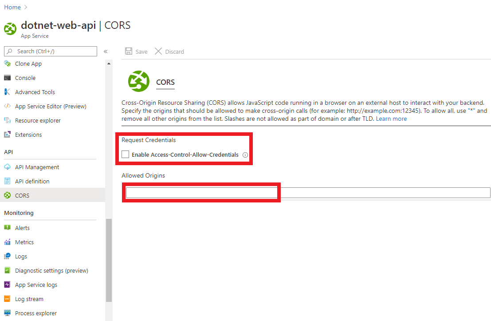

# Deploying a multi-tenant Angular single-page application that authenticates users with Azure AD and calls a protected ASP.NET Core web API

In this sample, we will deploy our project components, **TodoListAPI** and **TodoListSPA**, to Azure Cloud. For **TodoListAPI**, we will use **Azure App Services**, while for **TodoListSPA**, we will generate a static website and upload it to **Azure Stroge**.

## Contents

| File/folder       | Description                                |
|-------------------|--------------------------------------------|
| `TodoListAPI`     | Source code of the TodoList API.           |
| `TodoListSPA`     | Source code of the TodoList client SPA.    |
| `CHANGELOG.md`    | List of changes to the sample.             |
| `CONTRIBUTING.md` | Guidelines for contributing to the sample. |
| `README.md`       | This README file.                          |
| `LICENSE`         | The license for the sample.                |

## Prerequisites

- [Node.js](https://nodejs.org/en/download/) must be installed to run this sample.
- [Angular-cli](https://cli.angular.io/) must be installed to run this sample.
- [Dotnet Core SDK](https://dotnet.microsoft.com/download) must be installed to run this sample.
- *At least* **two** Azure Active Directory (Azure AD) tenants. For more information on how to get an Azure AD tenant, see [How to get an Azure AD tenant](https://azure.microsoft.com/documentation/articles/active-directory-howto-tenant/).
- On each tenant, *at least* **one** admin account and **one** non-admin/user account for testing purposes.
- An **Azure subscription**. This sample uses **Azure App Services** and **Azure Storage**.
- A modern Browser. This sample uses **ES6** conventions and will not run on **Internet Explorer**.
- We recommend [VS Code](https://code.visualstudio.com/download) for running and debugging this cross-platform application.
- We recommend [Azure Tools for VS Code Extension](https://marketplace.visualstudio.com/items?itemName=ms-vscode.vscode-node-azure-pack) for interacting with Azure services directly within VS Code.

## Setup

Using a command line interface such as VS Code integrated terminal, follow the steps below:

### Step 1. Install .NET Core API dependencies

```console
cd TodoListAPI
dotnet restore
```

### Step 2. Install Angular SPA dependencies

```console
cd ../
cd TodoListSPA
npm install
```

## Registration

### Register the service app (TodoListAPI)

Use the same app registration credentials that you've obtained during **chapter 2**.

### Register the client app (TodoListSPA)

Use the same app registration credentials that you've obtained during **chapter 2**.

## Deployment

### TodoListAPI

We will deploy our web API on [Azure App Services](https://azure.microsoft.com/services/app-service/).

Using a command line interface such as VS Code integrated terminal, follow the steps below:

#### Step 1. Initialize a local Git

```console
git init
```

Once the initalization is done. Commit all your files to your local Git.

#### Step 2. Deploy your app

Click on the Azure icon on the left bar in VS Code. Hover your mouse cursor to **App Service** section and you will see an upward-facing arrow icon. Click on it publish your local files to **Azure App Services**



#### Step 3. Modify your launchSettings.json

1. Open the `TodoListAPI\Properties\launchSettings.json` file.
2. Find all app keys `applicationUrl` and replace it with the base address of your web api e.g. `my-web-api.azurewebsites.net`.
3. Find the app key `launchUrl` and replace it with the api endpoint of your web api e.g. `my-web-api.azurewebsites.net/api/todolist`.

#### Step 4. Configure your app

On the **App Services** portal, click on the **Configuration** blade and set the **stack** property to **.NET Core**.



#### Step 5. Enable Azure AD authentication

Still on the **App Services** portal, click on the **Authentication/Authorization** blade. There, enable the App Services Authentication, then select Azure AD from the list below.  



Remember we already have an **app registration** for our **TodoListAPI** from the **chapter 2**. Here we will simply configure the **App Services** to use it. Hit on the **Advanced** mode and enter your `clientID` for **TodoListAPI**.



### TodoListSPA

Since TodoListSPA is a single-page application, we will deploy it as a **static website** on [Azure Storage](https://azure.microsoft.com/services/storage/). To do so, we will **build** our Angular sample to create a `dist` folder with compiled resources. Then we will make use of the [@azure/ng-deploy](https://www.npmjs.com/package/@azure/ng-deploy) for deployment.

Using a command line interface such as VS Code integrated terminal, follow the steps below:

#### Step 1. Build your app

```console
ng build --prod
```

#### Step 2. Deploy your app

```console
ng run angular9-todo-app:deploy
```

You may be prompted you to sign in to Azure, providing a link to open in your browser and a code to paste in the login page. Once you login, you will see an output **similar** to the following.

```console
see your deployed site at https://angular9-todo-app52.z22.web.core.windows.net/
```

#### Step 3. Register your new address as a redirect uri

You now need to go back to your Azure AD **app registration** for `TodoListSPA`:

   1. Click on the **Authentication** blade.
   2. Add your website's address (e.g. `https://angular9-todo-app52.z22.web.core.windows.net/`) as a new **Redirect URI**.

#### Step 4. Modify app-config.json

1. Open the `TodoListSPA\src\app\app-config.json` file
1. Find the key `todoListApi.redirectUri` and replace the existing value with the **redirect uri** that you've just registered in the previous step.
1. Find the key `todoListApi.resourceScope` and replace the existing value with the **redirect uri** that you've just obtained in deploying TodoListAPI (e.g. my-web-api.azurewebsites.net)
1. Re-build and re-deploy your files:

```console
ng build --prod
```

and finally:

```console
ng run angular9-todo-app:deploy
```

You should now be able to authenticate to your SPA and call your web API.

## Discussion

Here we discuss some of the more peculiar aspects of deploying multi-tenant application suites.

### CORS Configuration

We have setup our own [CORS](https://en.wikipedia.org/wiki/Cross-origin_resource_sharing) configuration in the **TodoListAPI** (`TodoListAPI/Startup.cs`) in the previous chapter:

```csharp
        public void ConfigureServices(IServiceCollection services)
        {
            // Allowing CORS for all domains and methods for the purpose of sample
            services.AddCors(o => o.AddPolicy("default", builder =>
            {
                builder.AllowAnyOrigin()
                       .AllowAnyMethod()
                       .AllowAnyHeader();
            }));
        }
        public void Configure(IApplicationBuilder app, IWebHostEnvironment env)
        {
            app.UseCors("default");
        }
```

> [!NOTE] In a real-world scenario, you should be selective with allowed origins i.e. you should allow only recognized domains.

If you like, you could delegate the control of **CORS** policy to **Azure App Services**. To do so, navigate to **App Services** portal, and then click on the **CORS** blade:



Then, you can add the domain of your single-page application as an **Allowed Origin**. Of course, if you follow this approach, don't forget to remove the CORS configuration in the `TodoListAPI/Startup.cs` (i.e. the code snipped above), as you no longer need it once you set up **Azure App Services** to enforce the **CORS** policy.

> [!NOTE] Did the sample not work for you as expected? Did you encounter issues trying this sample? Then please reach out to us using the [GitHub Issues](../issues) page.

## More information

- [Quickstart: Create an ASP.NET Core web app in Azure](https://docs.microsoft.com/en-us/azure/app-service/app-service-web-get-started-dotnet)
- [Tutorial: Authenticate and authorize users end-to-end in Azure App Service](https://docs.microsoft.com/en-us/azure/app-service/app-service-web-tutorial-auth-aad)
- [Authentication and authorization in Azure App Service and Azure Functions](https://docs.microsoft.com/en-us/azure/app-service/overview-authentication-authorization)
- [Configure your App Service or Azure Functions app to use Azure AD login](https://docs.microsoft.com/en-us/azure/app-service/configure-authentication-provider-aad)

## Contributing

If you'd like to contribute to this sample, see [CONTRIBUTING.MD](./CONTRIBUTING.md).

## Code of Conduct

This project has adopted the [Microsoft Open Source Code of Conduct](https://opensource.microsoft.com/codeofconduct/).
For more information see the [Code of Conduct FAQ](https://opensource.microsoft.com/codeofconduct/faq/) or
contact [opencode@microsoft.com](mailto:opencode@microsoft.com) with any additional questions or comments.
