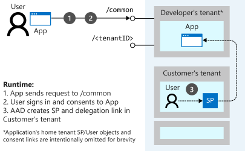
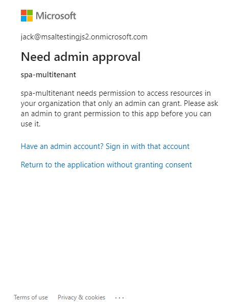

# Microsoft Identity Platform Multi-tenant Applications Tutorial

An incremental multi-tenancy tutorial demonstrating how to setup and configure your app, provide consent as admin to access it for the users in your tenant and deploy it on Azure App Services

## How to Use this tutorial

The aim of this tutorial is for you to understand aspects of **multitenancy** from an app *developer perspective*. The assumption is that you will review and try out each chapter before moving to the next one, as the concepts involved are built on top of each other and the explanations and illustrations will not be repeated.

## Contents

| File/folder       | Description                                |
|-------------------|--------------------------------------------|
| `Chapter1`        | Multitenant vanillaJS SPA calling MS Graph API. |
| `Chapter2`        | Multitenant Angular SPA with .NET Core Web API. |
| `Chapter3`        | Deployment with Azure App Services and Managed Identity. |
| `Misc`            | Contains screenshots and illustrations.    |
| `CHANGELOG.md`    | List of changes to the sample.             |
| `CONTRIBUTING.md` | Guidelines for contributing to the sample. |
| `README.md`       | This README file.                          |
| `LICENSE`         | The license for the sample.                |

## Prerequisites

Please refer to each chapter's subfolder for prerequisities.

> [!Note] We highly recommend getting familiar with regular samples first, in particular with [this](https://github.com/Azure-Samples/active-directory-javascript-graphapi-v2) and [this](https://github.com/Azure-Samples/ms-identity-javascript-angular-spa-aspnetcore-webapi), in order to fully grasp the naunces of the multi-tenant case.

## Setup

Using a command line interface such as VS Code integrated terminal, clone or download this repository

```console
git clone https://github.com/Azure-Samples/ms-identity-javascript-angular-spa-aspnetcore-webapi.git
```

> [!NOTE]
> Given that the name of the sample is quite long, and so are the names of the referenced NuGet packages, you might want to clone it in a folder close to the root of your hard drive, to avoid file size limitations on Windows.

### Step 2

Please refer to each chapter's subfolder for setup instructions.

## Discussion

### Understanding Tenancy in Azure AD

Azure Active Directory (Azure AD) organizes objects like users and apps into groups called tenants. Tenants allow an administrator to set policies on the users within the organization and the apps that the organization owns to meet their security and operational policies.

An application is said to be **multi-tenant** when users from tenant **A** can access and use an application created on tenant **B**. Once your application is **multi-tenant**, users in any Azure AD tenant will be able to sign in to your application after they (and their **tenant-admin**) consent to use their account with your application.

To give an overview, in order to make your app **multi-tenant**, you'll have to:

1. Update your application registration to be multi-tenant.
2. Update your code to send requests to the `/common` (or `/organizations`) endpoint.
3. Implement a mechanism in your app for providing **admin-consent**.

These steps will be discussed in more detail in **chapter 1** and **chapter 2**. In carrying out these steps, remember the ultimate goal: **provisioning your application** to another tenant. In order to understand **application provisioning**, you first need to understand what is meant by **application**.

### Applications and Service Principals

The meaning of the term "application" can be misunderstood when used in the context of Azure Active Directory (Azure AD). An application that has been integrated with Azure AD has implications that go beyond the software aspect. "Application" is frequently used as a conceptual term, referring to not only the application software, but also its Azure AD registration and role in authentication/authorization "conversations" at runtime.

An Azure AD application is defined by its one and only **application object**, which resides in the Azure AD tenant where the application was registered, known as the application's "home" tenant. The Microsoft Graph [Application entity](https://docs.microsoft.com/graph/api/resources/application) defines the schema for an application object's properties.

To access resources that are secured by an Azure AD tenant, an application that requires access must be represented by a **service principal**. The service principal defines the access policy and permissions for the application in the Azure AD tenant. This enables core features such as authentication of the user/application during sign-in, and authorization during resource access. When an application is given permission to access resources in a tenant (upon registration or consent), a [service principal object](https://docs.microsoft.com/graph/api/resources/serviceprincipal) is created.

> #### Relationship between Applications and Service Principals
>
>Consider the application object as the *global representation* of your application for use across all tenants, and the service principal as the *local representation* for use in a specific tenant. The application object serves as the template from which common and default properties are derived for use in creating corresponding service principal objects. An application object therefore has a **1:1 relationship** with the software application, and a **1:many relationships** with its corresponding service principal object(s).
>
>A service principal must be created in each tenant where the application is used, enabling it to establish an identity for sign-in and/or access to resources being secured by the tenant. A single-tenant application has only one service principal (in its home tenant), created and consented for use during application registration. A multi-tenant application also has a service principal created in each tenant where a user from that tenant has consented to its use.

### Permissions and Admin Consent

For a user to sign in to an application in Azure AD, the application must be represented in the user’s tenant. For a multi-tenant application, the initial registration for the application lives in the Azure AD tenant used by the developer. When a user from a different tenant signs in to the application for the first time, Azure AD asks them to consent to the permissions requested by the application. If they consent, then a representation of the application called a service principal is created in the user’s tenant, and sign-in can continue. A delegation is also created in the directory that records the user’s consent to the application.



This consent experience is affected by the permissions requested by the application. Microsoft identity platform supports two kinds of permissions, app-only and delegated.

- A **delegated permission** grants an application the ability to act as a signed in user for a subset of the things the user can do. For example, you can grant an application the delegated permission to read the signed in user’s calendar.

- An **app-only permission** is granted directly to the identity of the application. For example, you can grant an application the app-only permission to read the list of users in a tenant, regardless of who is signed in to the application.

In this tutorial we focus on delegated permissions. Some permissions can be consented to by a regular user, while others require a tenant administrator’s consent. For example, the ability to write back to Azure AD as the signed in user requires a tenant administrator’s consent. If an ordinary user tries to sign in to an application that requests a delegated permission that requires administrator consent, your application receives an error.



Whether a permission requires admin consent is determined by the developer that published the resource, and can be found in the documentation for the resource. The [permissions documentation](https://docs.microsoft.com/graph/permissions-reference) for the **Microsoft Graph API** indicate which permissions require **admin*consent**.

To see how to provide **admin-consent**, continue to review the sample in [chapter 1](./chapter1).

### Audiences and Account Types

- /common, /organizations
- /.default scope
- KnownClientApplications

## More information

For more information, visit the following links:

- Articles about the Microsoft identity platform are at [http://aka.ms/aaddevv2](http://aka.ms/aaddevv2), with a focus on:
  - [Permissions and Consent](https://docs.microsoft.com/azure/active-directory/develop/v2-permissions-and-consent)
  - [Applications and Service Principals](https://docs.microsoft.com/azure/active-directory/develop/app-objects-and-service-principals)
  - [Tenancy in Azure AD](https://docs.microsoft.com/azure/active-directory/develop/single-and-multi-tenant-apps)
  - [Converting an Application to Multi-tenant](https://docs.microsoft.com/azure/active-directory/develop/howto-convert-app-to-be-multi-tenant)

- To lean more about the application registration, visit:
  - [Quickstart: Set up a tenant](https://docs.microsoft.com/azure/active-directory/develop/quickstart-create-new-tenant)
  - [Quickstart: Register an application with the Microsoft identity platform](https://docs.microsoft.com/azure/active-directory/develop/quickstart-register-app)
  - [Quickstart: Configure a client application to access web APIs](https://docs.microsoft.com/azure/active-directory/develop/quickstart-configure-app-access-web-apis)
  - [Quickstart: Configure an application to expose web APIs](https://docs.microsoft.com/azure/active-directory/develop/quickstart-configure-app-expose-web-apis)

## Community Help and Support

Use [Stack Overflow](http://stackoverflow.com/questions/tagged/msal) to get support from the community.
Ask your questions on Stack Overflow first and browse existing issues to see if someone has asked your question before.
Make sure that your questions or comments are tagged with [`msal` `dotnet` `angular` `azure-active-directory`].

If you find a bug in the sample, please raise the issue on [GitHub Issues](../../issues).

To provide a recommendation, visit the following [User Voice page](https://feedback.azure.com/forums/169401-azure-active-directory).

## Contributing

This project welcomes contributions and suggestions.  Most contributions require you to agree to a
Contributor License Agreement (CLA) declaring that you have the right to, and actually do, grant us
the rights to use your contribution. For details, visit https://cla.opensource.microsoft.com.

When you submit a pull request, a CLA bot will automatically determine whether you need to provide
a CLA and decorate the PR appropriately (e.g., status check, comment). Simply follow the instructions
provided by the bot. You will only need to do this once across all repos using our CLA.

## Code of Conduct

This project has adopted the [Microsoft Open Source Code of Conduct](https://opensource.microsoft.com/codeofconduct/).
For more information see the [Code of Conduct FAQ](https://opensource.microsoft.com/codeofconduct/faq/) or
contact [opencode@microsoft.com](mailto:opencode@microsoft.com) with any additional questions or comments.